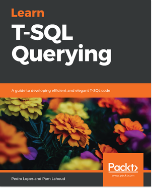
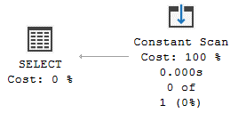
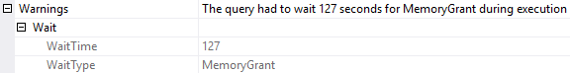
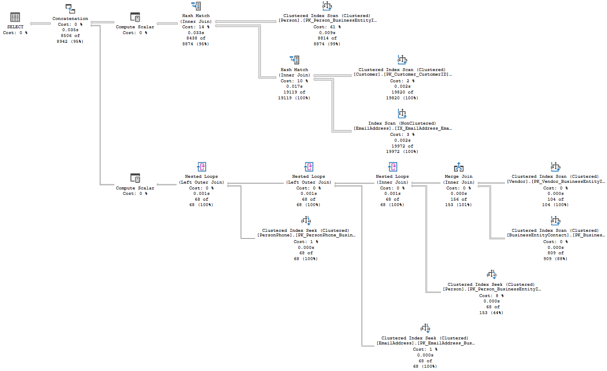

# Learn T-SQL Querying: A guide to developing efficient and elegant T-SQL code

This repo holds an errata and code samples for the book.



## Description

Transact-SQL (T-SQL) is Microsoft's proprietary extension to the SQL language that is used with Microsoft SQL Server and Azure SQL Database. This book will be a useful guide to learning the art of writing efficient T-SQL code in modern SQL Server versions, as well as the Azure SQL Database.

The book will get you started with query processing fundamentals to help you write powerful, performant T-SQL queries. You will then focus on query execution plans and learn how to leverage them for troubleshooting. In the later chapters, you will learn how to identify various T-SQL patterns and anti-patterns. This will help you analyze execution plans to gain insights into current performance, and determine whether or not a query is scalable. You will also learn to build diagnostic queries using dynamic management views (DMVs) and dynamic management functions (DMFs) to address various challenges in T-SQL execution. Next, you will study how to leverage the built-in tools of SQL Server to shorten the time taken to address query performance and scalability issues. In the concluding chapters, the book will guide you through implementing various features, such as Extended Events, Query Store, and Query Tuning Assistant using hands-on examples.
By the end of this book, you will have the skills to determine query performance bottlenecks, avoid pitfalls, and discover the anti-patterns in use.

Foreword by Conor Cunningham, Partner Architect – SQL Server and Azure SQL – Microsoft

## Errata

### Pages 26, 30, and 38
Regarding the text in the picture (bottom right box) in some reprints of the book.

**It is:**
Return plan in cache

**Should be:**
Return plan to cache

### Page 35 in e-book :: 36 in printed book

**It is:**             
"When Forced Parameterization is turned on, SQL Server will replace ALL literal values in ALL ad hoc queries with parameter markers." 

**Clarification:**             
The statement above from the book is correct for the widest use cases and we didn’t want to nitpick on edge case details. The documented exceptions are either edge cases that most developers will not face (for example, statements that contain more than 2,097 literals), or a non-starter because they’re parameterized no matter whether forced parameterization is ON or not, such as when statements contain the RECOMPILE query hint, statements inside the bodies of stored procedures, triggers, or user-defined functions, or prepared statements that have already been parameterized on the client-side application. For more information, see the [Forced Parameterization](https://docs.microsoft.com/sql/relational-databases/query-processing-architecture-guide#ForcedParam) section in Microsoft's Query Processing Architecture Guide.
 
### Page 39 in e-book :: 40 in printed book

**It is:**             
When describing SQL injection, the book says:             

This time, if the user were to send the same input, rather than executing the query that the user embedded in the string, the SQL Server will insert a row into the Users table, with the Name column set to `('Bob'); DROP TABLE Users; --'`. This would obviously look a bit strange, but it wouldn't break the application or breach security.

**Should be:**             
This time, if the user were to send the same input, rather than executing the query that the user embedded in the string, the SQL Server will insert a row into the Users table, with the Name column set to `'Bob'); DROP TABLE Users; --'`. This would obviously look a bit strange, but it wouldn't break the application or breach security.

### Page 48 in printed book

**It is:**             
In the table listing database compatibility levels, the book says 120 as the Database compatibility level for SQL Server 2016.             

**Should be:**             
130 is the Database compatibility level for SQL Server 2016, the same as the CE version.  

### Page 114

**Missing content at the top of page 114**

The query generates the following execution plan:
 
 

And by setting ANSI_NULLS to OFF:

```
SET ANSI_NULLS OFF
GO
SELECT *
FROM Sales.SalesOrderDetail AS sod
INNER JOIN Production.Product AS p ON sod.ProductID = p.ProductID
WHERE SellEndDate = NULL
ORDER BY Style DESC
OPTION (MAXDOP 1);
GO
```

**Continues page 114**

### Page 115 in e-book :: 117 in printed book

**It is:**             
When referring to wait stats in the plan, the book says:             

(...) additional information about the top 10 waits accrued while the query was executing in the scope of the current session, in descending order of wait time.

**Should be:**             
(...) additional information about the top 10 waits accrued while the query was executing in the scope of the current session, in ascending order of wait 
time in SQL Server 2019, and descending order up to SQL Server 2017.

### Page 125 in e-book :: 128 in printed book

There are two images on the page. The first one is incorrect and is a copy of the second image.

The correct first image should be the following:



### Page 217 in e-book :: 223 in printed book

The first image is incorrect.

The correct first image should be the following:



## Code Samples

Coming soon.
### Download a free PDF

 <i>If you have already purchased a print or Kindle version of this book, you can get a DRM-free PDF version at no cost.<br>Simply click on the link to claim your free PDF.</i>
<p align="center"> <a href="https://packt.link/free-ebook/9781789348811">https://packt.link/free-ebook/9781789348811 </a> </p>